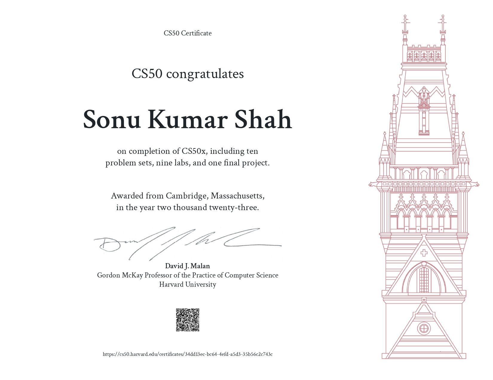

# Certifications

## Harvard University Certifications
##### These are my first & favorite certifications :)
<table style="border-collapse: collapse; border: none; width: 100%;">
  <tr>
    <td style="padding: 0; margin: 0;"></td>
    <td style="padding: 0; margin: 0;"></td>
  </tr>
  <tr>
    <td style="padding: 0; margin: 0;"></td>
    <td style="padding: 0; margin: 0;"></td>
  </tr>
  <tr>
    <td style="padding: 0; margin: 0;"></td>
  </tr>
</table>

## LLMs Specialization Certificates
<table style="border-collapse: collapse; border: none; width: 100%;">
  <tr>
    <td style="padding: 0; margin: 0;"></td>
  </tr>
</table>

## GANs Specialization Certificates
<table style="border-collapse: collapse; border: none; width: 100%;">
  <tr>
    <td style="padding: 0; margin: 0;"></td>
    <td style="padding: 0; margin: 0;"></td>
  </tr>
</table>

## Mathematics ML Specialization Certificates
<table style="border-collapse: collapse; border: none; width: 100%;">
  <tr>
    <td style="padding: 0; margin: 0;"></td>
    <td style="padding: 0; margin: 0;"></td>
  </tr>
</table>

## Natural language processing Specialization Certificates
<table style="border-collapse: collapse; border: none; width: 100%;">
  <tr>
    <td style="padding: 0; margin: 0;"></td>
    <td style="padding: 0; margin: 0;"></td>
    <td style="padding: 0; margin: 0;"></td>
  </tr>
</table>

## Advance TensorFlow Specialization Certificates
<table style="border-collapse: collapse; border: none; width: 100%;">
  <tr>
  </tr>
</table>

## Deep Learning Specialization Certificates
<table style="border-collapse: collapse; border: none; width: 100%;">
  <tr>
    <td style="padding: 0; margin: 0;"></td>
    <td style="padding: 0; margin: 0;"></td>
    <td style="padding: 0; margin: 0;"></td>
  </tr>
  <tr>
    <td style="padding: 0; margin: 0;"></td>
    <td style="padding: 0; margin: 0;"></td>
    <td style="padding: 0; margin: 0;"></td>
  </tr>
</table>

## Coursera Projects Certificates
<table style="border-collapse: collapse; border: none; width: 100%;">
  <tr>
    <td style="padding: 0; margin: 0;"></td>
  </tr>
</table>

## ILLINOIS TECH - DSA Certifications
<table style="border-collapse: collapse; border: none; width: 100%;">
  <tr>
    <td style="padding: 0; margin: 0;"></td>
    <td style="padding: 0; margin: 0;"></td>
  </tr>
</table>

## OpenSOurce Contribution
<table style="border-collapse: collapse; border: none; width: 100%;">
  <tr>
    <td style="padding: 0; margin: 0;"></td>
  </tr>
</table>
